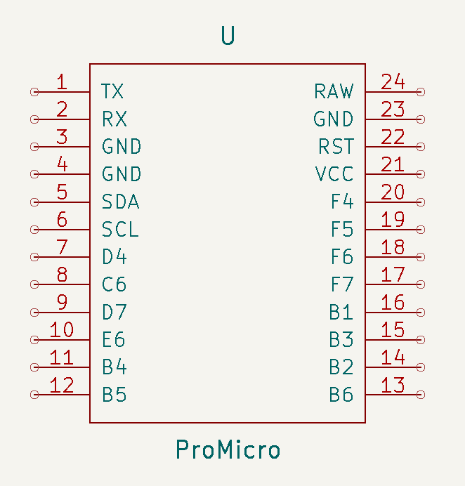
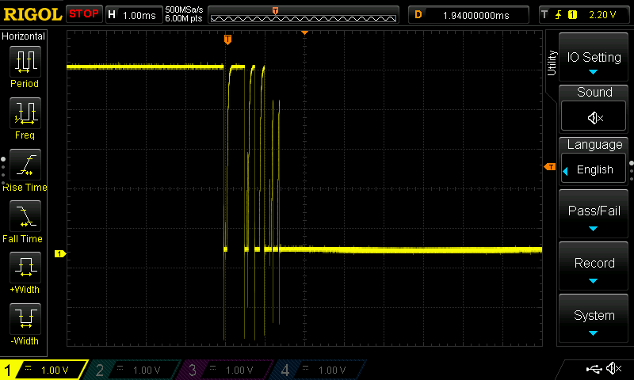
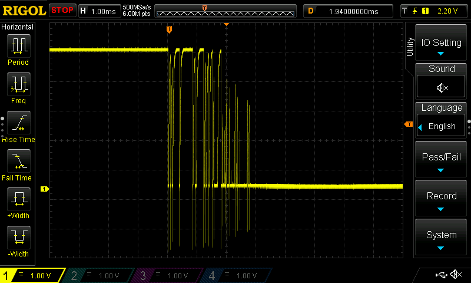

# Arduino software

It uses the [HID keyboard library](https://www.arduino.cc/reference/en/language/functions/usb/keyboard/).

For details about how set up your board see [setup-instructions.md](setup-instructions.md).

Only eight buzzers are supported and the Arduino has twelve digital I/O pins, so no [matrix circuit](https://en.wikipedia.org/wiki/Keyboard_matrix_circuit) is needed.

## Supported hardware

Not all Arduino boards can be used because the keyboard library requires a microcontroller with built-in USB support. For example, the Arduino Uno and Mega have a separate chip to do USB communication which doesn't let us do HID keyboard.

This project uses an [Sparkfun Pro Micro](https://www.sparkfun.com/products/12640) (informally called "Arduino Pro Micro"). It has ATmega32U4 chip which has USB built-in!

## KiCad symbol pin vs Arduino pin number

The KiCad symbol & footprint are from the [ProMicroKiCad](https://github.com/Biacco42/ProMicroKiCad) repository by GitHub user Biacco42. The pin numbering in the KiCad symbol starts at one and increases by one for each pin.

To use the Arduino [`digitalRead()`](https://www.arduino.cc/reference/en/language/functions/digital-io/digitalread/) function we need to know the "Arduino pin number". According to the [SparkFun Pro Micro Hookup  Guide](https://learn.sparkfun.com/tutorials/pro-micro--fio-v3-hookup-guide#hardware-overview-pro-micro), the Arduino pin numbers are discontinuous and not monotone.

<table>
<tr>
<td align="center"> KiCad symbol</td>
<td align="center"> Arduino pin numbers</td>
</tr>
</table>

Here's a a table to cross-reference the pin numbers (excluding RX, TX, RAW, GND, and VCC):

| KiCad symbol | Arduino pin  | &emsp;&emsp; | KiCad symbol | Arduino pin |
| --------------- | --------------- | ------------ | --------------- | -------------- |
|       5         |        2        | &emsp;&emsp; |       20        |        21      |
|       6         |        3        | &emsp;&emsp; |       19        |        20      |
|       7         |        4        | &emsp;&emsp; |       18        |        19      |
|       8         |        5        | &emsp;&emsp; |       17        |        18      |
|       9         |        6        | &emsp;&emsp; |       16        |        15      |
|      10         |        7        | &emsp;&emsp; |       15        |        14      |
|      11         |        8        | &emsp;&emsp; |       14        |        16      |
|      12         |        9        | &emsp;&emsp; |       13        |        10      |

## Debouncing

Contacts in a mechanical switch bounce when actuated, which makes the signal appear to be repeatedly opening/closing. [Debouncing](https://en.wikipedia.org/wiki/Keyboard_technology#Debouncing) waits for the signal to settle before deciding if the switch moved.

The debouncing logic is from an Arduino example, which is accessible [online](https://docs.arduino.cc/built-in-examples/digital/Debounce) and in the Arduino software from File > Examples > 02.Digital > Debounce.

I measured the settling time for both brands of footswitches I'm using then chose 5 milliseconds debounce time.

<table>
<tr>
<td align="center"> TEMCo</td>
<td align="center"> Treadlite</td>
</tr>
</table>
