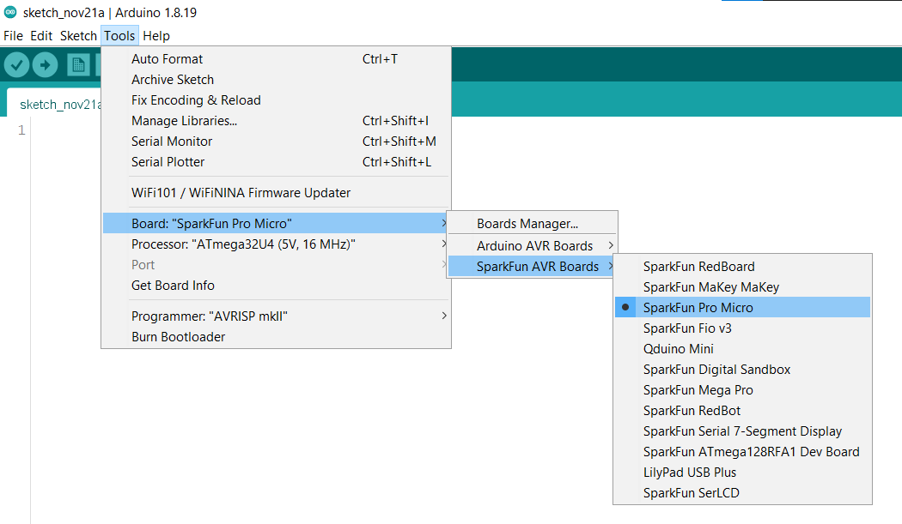
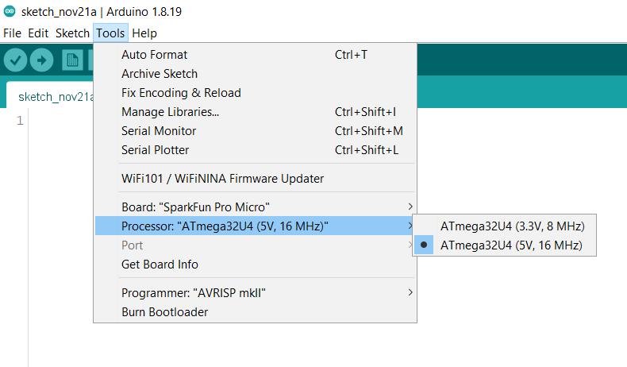
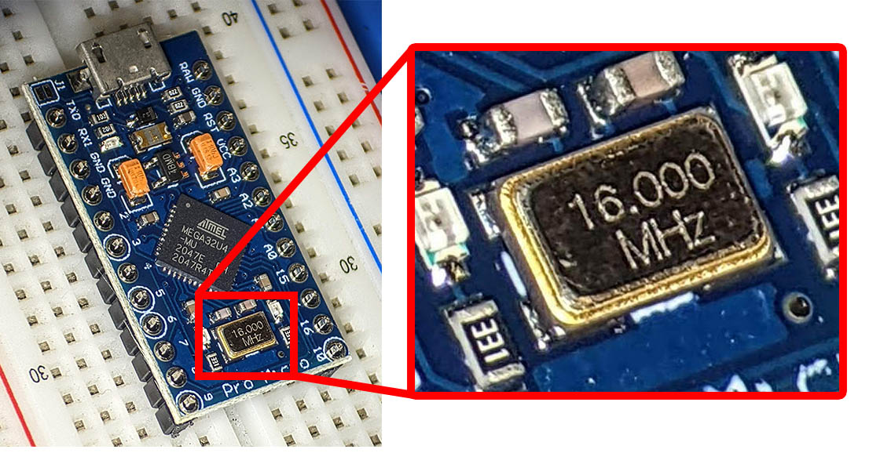
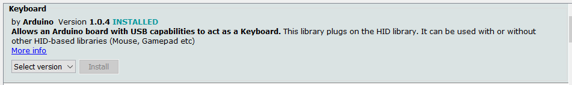

# Setup instructions

These screenshots are from version 1.x of the Arduino software. For version 2.x, the steps are the same but the UI looks different.

## Set up the Arduino software

Install & launch the Arduino software and connect your Arduino board to your computer. 

Next, follow the [Pro Micro Hookup Guide](https://learn.sparkfun.com/tutorials/pro-micro--fio-v3-hookup-guide#windows_boardaddon) to:

* edit Preferences in the Arduino software to add a URL to the "Additional Board Manager URLs", then
* install the board using the Boards Manager.

When finished, you should be able to select Tools > Board > SparkFun AVR Boards > SparkFun Pro Micro:

Once you select that board, the Tools menu will have another sub-menu called Processor:

There are two options:

* If the clock speed is 16 MHz, then the voltage is 5 V.
* If the clock speed is 8 MHz, then the voltage is 3.3 V.

To tell which version you have, look for a relatively large shiny silver rectangle or oval on your Arduino board. That is the [crystal oscillator](https://en.wikipedia.org/wiki/Crystal_oscillator). The clock speed will be marked on top. To read the marking you will probably need to hold the board at an angle, and you might need magnification.

Here's what it looks like on the board I have:

You can also just try both processor options. Try uploading the [example Blinkies sketch](https://learn.sparkfun.com/tutorials/pro-micro--fio-v3-hookup-guide/example-1-blinkies) sketch. If the right processor is selected, the upload will finish in a few seconds. Otherwise, the upload will hang or fail and print weird errors. If that happens, unplug the USB cable connecting the Arduino board to your computer and the upload process wil immediately stop.

See the Arduino help page ['Error: avrdude' when uploading](https://support.arduino.cc/hc/en-us/articles/4401874331410--Error-avrdude-when-uploading#avrdude-stk500_recv-and-stk500_getsync).

## Install the keyboard library

1. Click Tools > Manage Libraries.

1. Search for the Keyboard library, select the newest version, and install it:

    

    Link to documentation: 

    * https://www.arduino.cc/reference/en/language/functions/usb/keyboard/
