# KiCad project

Pictures of the PCB:

<table>
<tr>
<td>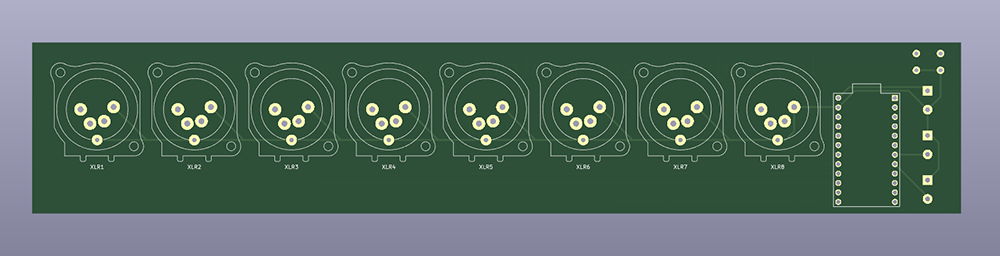</td>
<td>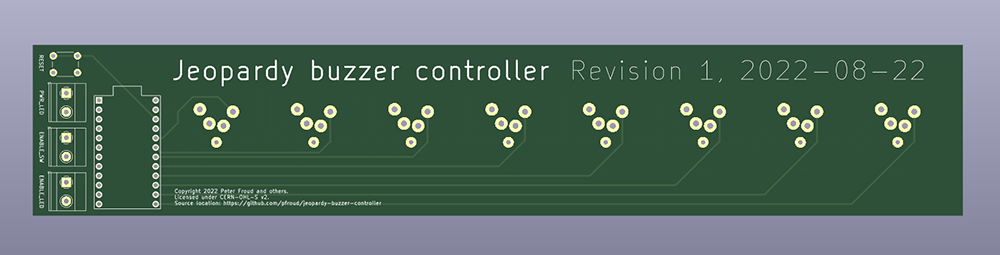</td>
</tr>
<tr>
<td>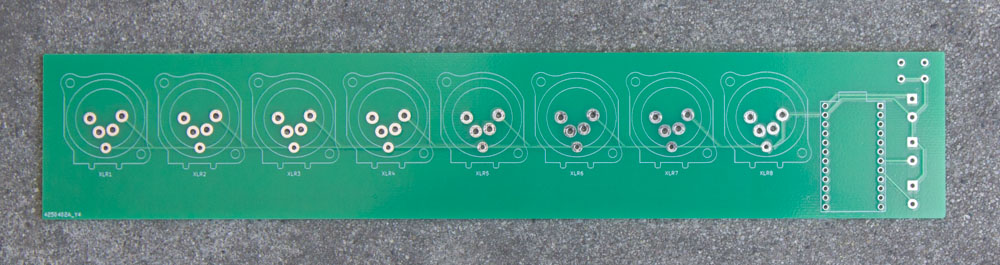</td>
<td>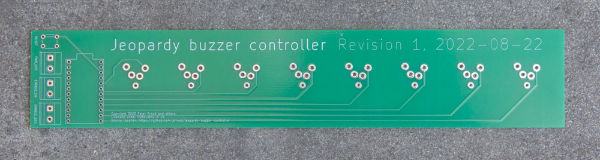</td>
</tr>
</table>

Only eight buzzers are supported and the Arduino has twelve digital I/O pins, so no [matrix circuit](https://en.wikipedia.org/wiki/Keyboard_matrix_circuit) is needed.

## Schematic screenshots

Here are screenshots of the schematic so you don't need to download / install / launch KiCad:

<table>
<tr>
<td>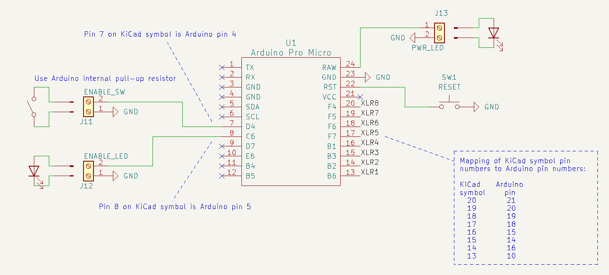</td>
<td>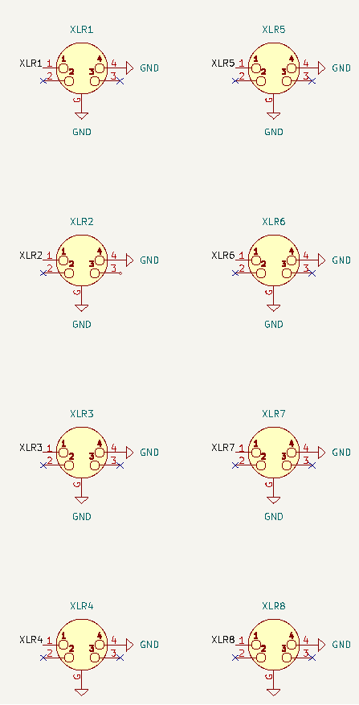</td>
</tr>
</table>

## XLR connector

They are [Neutrik NC4MBV](https://www.neutrik.com/en/product/nc4mbv-1) which are:

> 4 pole male XLR receptacle, grounding: separate ground contact to mating connector shell and front panel.

Each connector has four cylindrical pins with shoulders. A rectangular tab on the bottom contacts the shell of the mating connector.

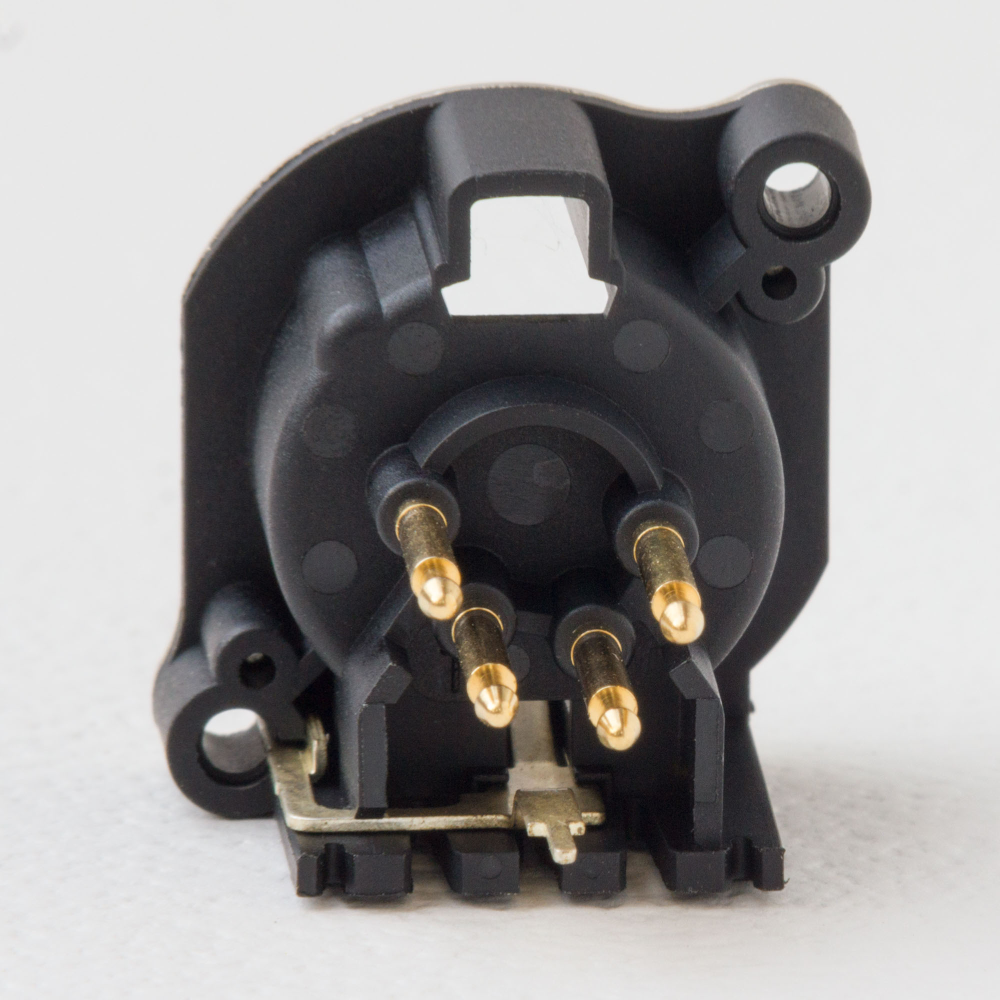

KiCad comes with symbols & footprints for 4-pin XLR connectors; I modified both slightly.

### Symbol

I added a ground pin to the "XLR4" symbol in the KiCad [Connector](https://kicad.github.io/symbols/Connector) library:

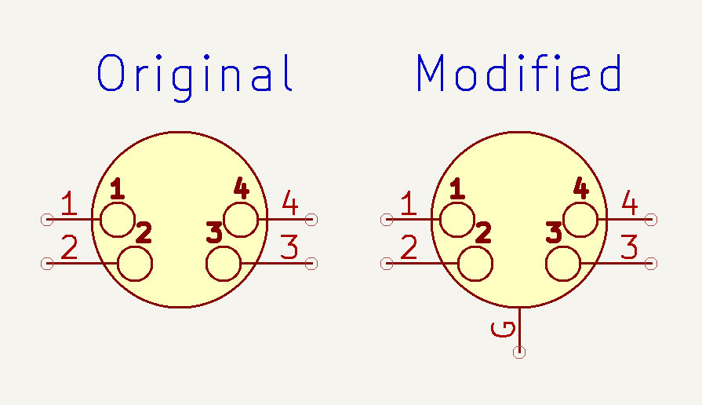

### Footprint

I started with the "Jack_XLR_Neutrik_NC4MBV_Vertical" footprint in the KiCad [Connector_Audio](https://kicad.github.io/footprints/Connector_Audio) library, which  exactly matches the footprint provided by Neutrik.

After the PCB was fabricated, I saw that those dimensions hold the connector about  &frac14; inch (6 mm) above the board. The shoulders of the cylindrical pins and the square section of the ground tab both rest on the PCB surface. I think this looks sort of silly and expected the black plastic housing to touch the board.

To see a comparison, I drilled out the pads on an extra board. In the pictures below, the original footprint is on the left and the footprint with drilled-out holes is on the right:

<table>
<tr>
<td>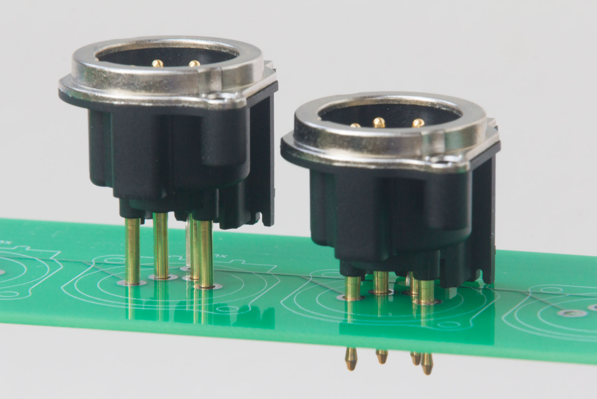</td>
<td>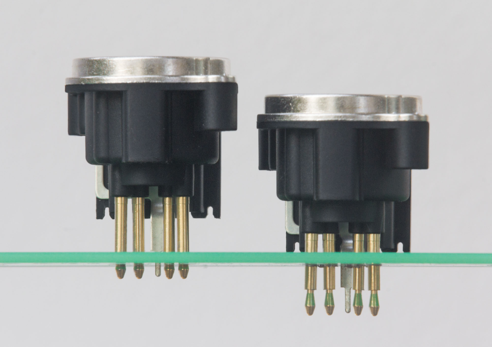</td>
</tr>
</table>

I edited the footprint to make the black plastic housing touch the PCB. First I increased the sizes of pads 1-4 so the full diameter of the cylinder could go through the board. Then I changed the ground pin from a circle to a slot to let the bigger non-square part of the ground tab go through as well.

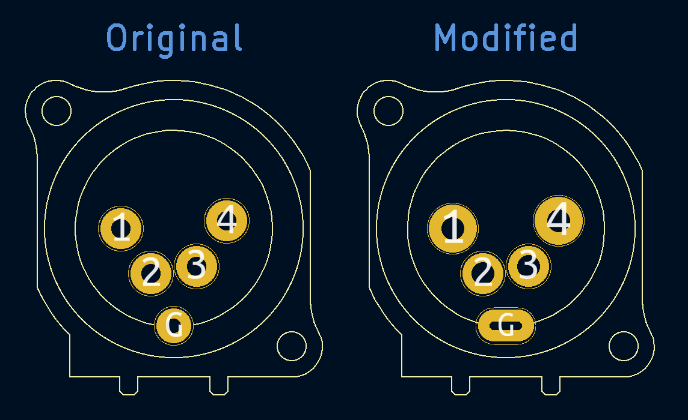

But I never got a board fabricated with the modified footprint! When assembling the PCB into the [enclosure](../docs/enclosure.md), I discovered that having the connectors on long legs was actually very helpful because they could bend slightly to accommodate imperfect hole alignment in the plastic wall.
