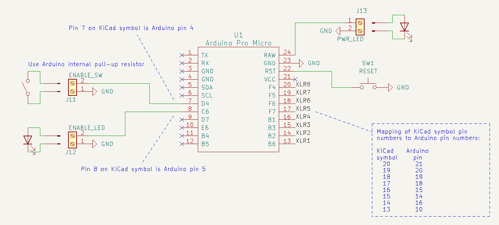
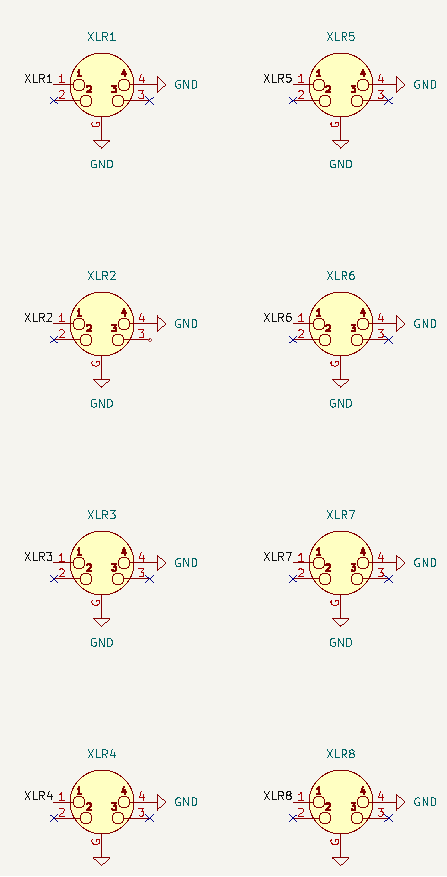

# KiCad project

Here are screenshots of the schematic so you don't need to download / install / launch KiCad.

Only eight buzzers are supported and the Arduino has twelve digital I/O pins, so no [matrix circuit](https://en.wikipedia.org/wiki/Keyboard_matrix_circuit) is needed.

