# Jeopardy buzzer controller

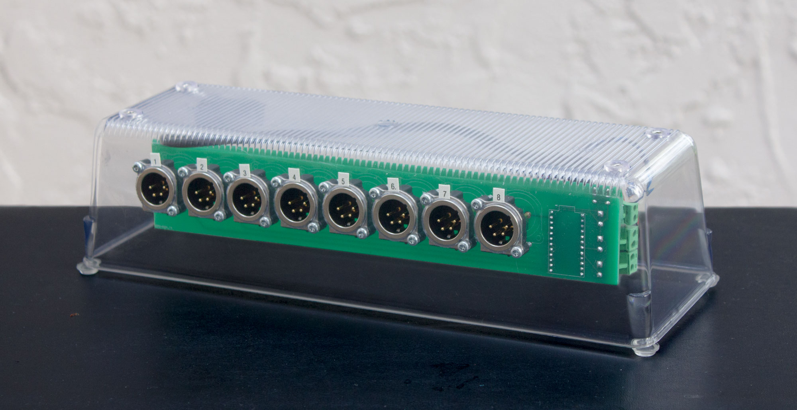

## About

For use with my [Jeopardy software](https://github.com/pfroud/jeopardy).

This device uses an Arduino to emulate a USB HID keyboard (like a QWERTY keyboard not a music keyboard). Instead of normal keyboard keys, the inputs come from rugged metal footswitches on long cables.

The sole purpose of this device is to convert physical button presses into USB HID keystrokes. It cannot tell which person buzzed first for a question, for example. All of that logic is done by software running on the host PC.

The PCB was designed using KiCad version 6 and fabricated by JLCPCB.

## Parts

The two most interesting parts are:

* [Sparkfun Pro Micro](https://www.sparkfun.com/products/12640) (not Mini, not Nano)
    * Informally called "Arduino Pro Micro" but it's actually a Sparkfun product which is Arduino-compatible.
    * To learn about the software running on the Arduino, see the [Arduino directory](Arduino).
* [XLR receptacle NC4MBV](https://www.neutrik.com/en/product/nc4mbv-1) to connect the buzzers.
    * To learn more, go to the "XLR connectors" section in this document.

Other parts:

* [12-pin female headers](https://www.aliexpress.us/item/2255801012106911.html) to hold the Arduino.
    * The Arduino could instead be soldered directly to the PCB if you're feeling confident.
* A toggle switch to enable/disable the Arduino software.
    * Lets you turn the buzzers off without unplugging the USB cable.
* [Panel-mount LED lights](https://www.aliexpress.com/item/3256803816108154.html) to indicate when it's powered and enabled.
* [2-pin pluggable terminal blocks](https://www.aliexpress.us/item/2251832631116561.html) to connect the toggle switch and indicator LEDs to the PCB.
* A 6mm tactile pushbutton to reset the Arduino.
    * The Pro Micro does not have a built-in reset button.

## Buzzers

On the Jeopardy TV show each contestant holds a thumb-operated buzzer ([source](https://www.jeopardy.com/jbuzz/behind-scenes/how-does-jeopardy-buzzer-work)).

My game has teams instead of individual players, so the buzzers rest on a table for access by all team members. I got rugged metal footswitches to withstand being slammed when someone thinks of an answer.

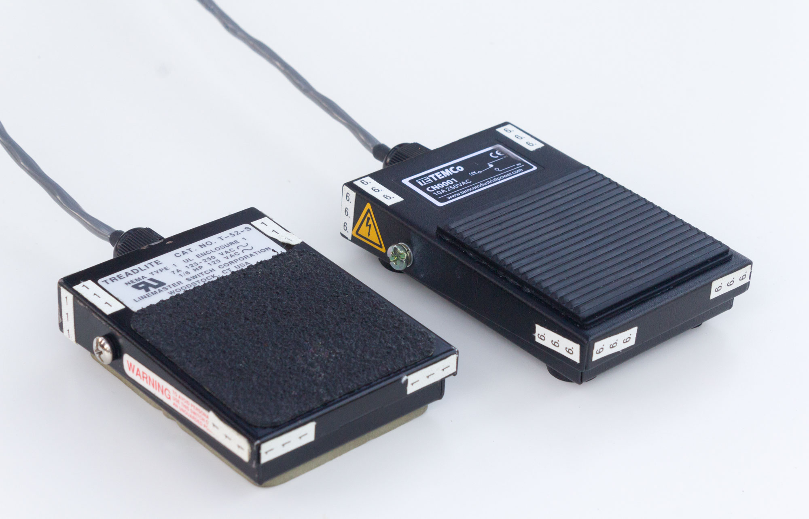

I started with Treadlite footswitches from at HSC Electronics (RIP) then got some TEMCo ones from [eBay](https://www.ebay.com/itm/372481343124).

On each footswitch I had to grind down the metal housing a little to fit a [PG7 cord grip](https://www.ebay.com/itm/222727122407). (PG stands for [Panzergewinde](https://en.wikipedia.org/wiki/Panzergewinde) which is an old German thread standard inexplicably still in use.)

The Treadlite model (below left) has a seemingly-custom switch mechanism inside, while the TEMCo model (below right) has a standard limit switch. The Treadlite ones originally come with *two* switches mounted at different heights but I removed the lower ones. The cable I used has a foil shield so I connected the drain wire to the metal housing for fun.

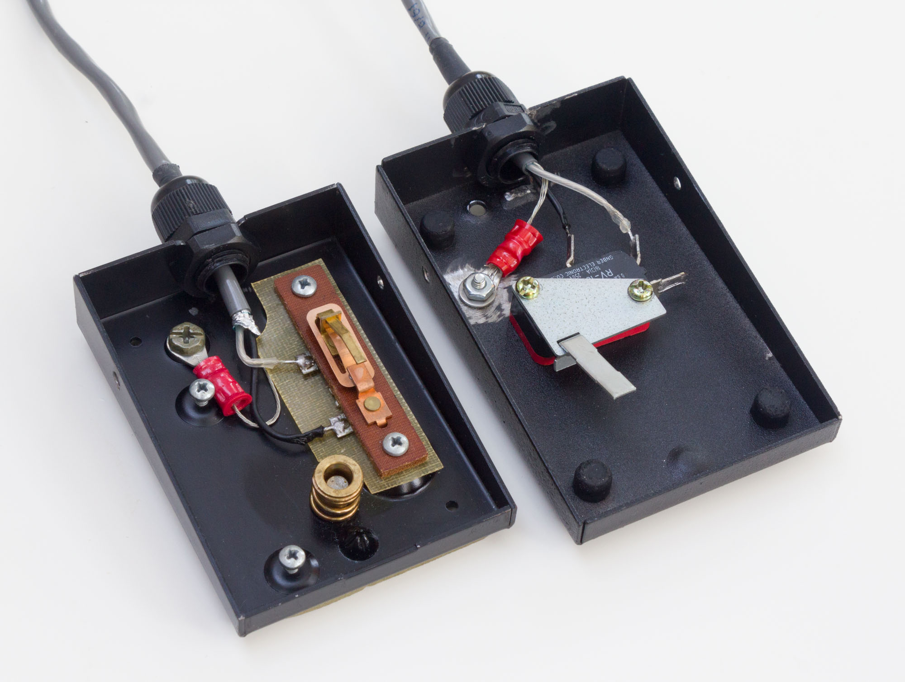

Eight buzzers are supported although I rarely use more than six.

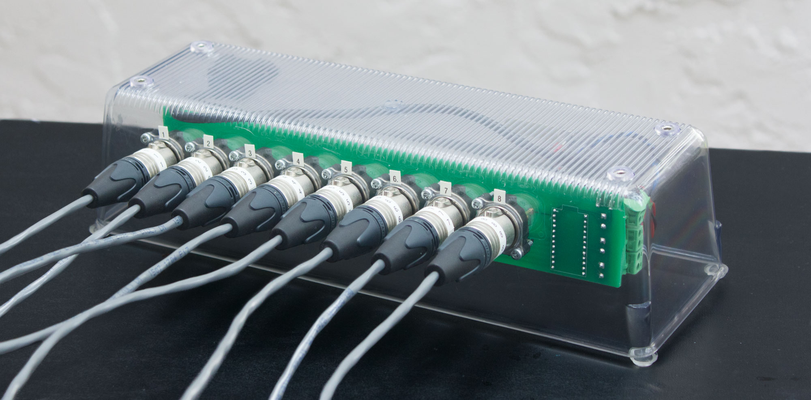

## Known bugs & future work

### PCB design

* There is no input protection on the Arduino pins.
* The trace length between the Arduino and XLR connector is different for each connector.

### Does using an HID keyboard for this make any sense??

Not really. The original scope of my [Jeopardy project](https://github.com/pfroud/jeopardy) was software only. The hardware buzzers have been gradually developed as needed. Want to keep it simple!

See docs/dont-use-a-HID-keyboard.md.

### Issues with the XLR connectors

XLR connectors are usually used in professional audio and stage lighting, so they are overkill for this application. I wanted locking connectors and found these in surplus.

#### Wasted pins

Only two out of four pins are used. In the future, the spare pins could be used for lighting or some other new feature. An overwhelming number of two-pin locking connectors are available.

#### Polarity

The polarity of the XLR connectors should be reversed.

Neutrik makes four types of 4-pin XLR connectors. Look at the table below for a visual aid.

The receptacles on the controller are male (top left, NC4MBV) which allows fingers to touch the pins, exposing the Arduino to static electricity.

Meanwhile the connectors on the buzzer cables are female (bottom right, NC4FXX). The recessed pins prevent fingers touching them, but that protection isn't needed because the buzzers contain only passive switches.

The controller should use female receptacles, and the buzzers should use male cable connectors.

<table>
<tr>
    <td></td>
    <td align="center">Male</td>
    <td align="center">Female</td>
</tr>
<tr>
    <td>Receptacle</td>
    <td align="center">
        <a href="https://www.neutrik.us/en-us/product/nc4mbv-1">
            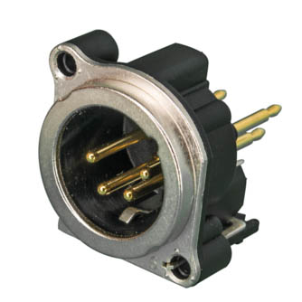
             
            NC4MBV
        </a>
    </td>
    <td align="center">
        <a href="https://www.neutrik.us/en-us/product/nc4fbv">
            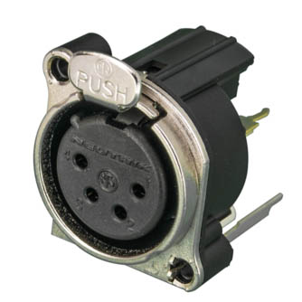
             
            NC4FBV
        </a>
    </td>
</tr>
<tr>
    <td>Cable connector</td>
    <td align="center">
        <a href="https://www.neutrik.us/en-us/product/nc4mxx">
            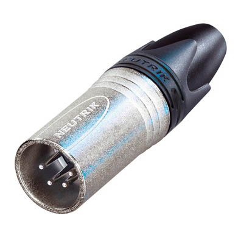
             
            NC4MXX
        </a>
    </td>
    <td align="center">
        <a href="https://www.neutrik.us/en-us/product/nc4fxx">
            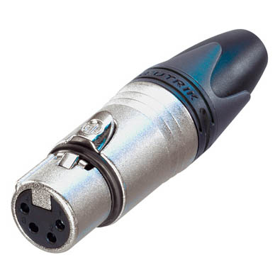
             
            NC4FXX
        </a>
    </td>
</tr>
</table>

## Previous versions of my Jeopardy buzzer controller

I made my first Jeopardy buzzer controller in 2018. It used the the PCB from an off-the-shelf USB keyboard (a QWERTY keyboard not a music keyboard) to convert physical button presses into USB HID keystrokes.

Inside the case of a broken power tool battery charger was a tangle of wires and Wago lever nuts. I used barrel jacks intended for DC power to connect the buzzers because they were easily available. This worked acceptably well but looked crazy:

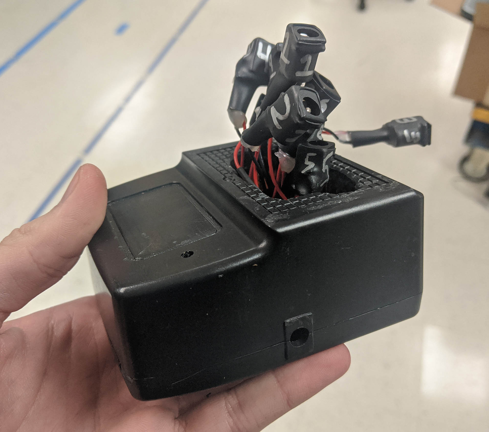

In 2020 re-did the enclosure and wiring but kept using barrel jacks:

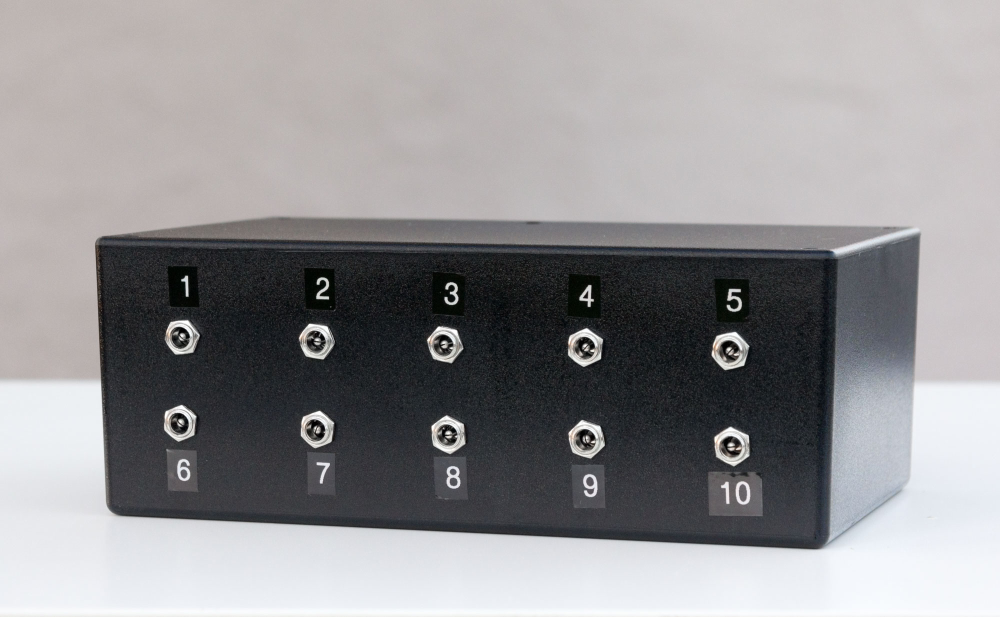

Inside the new enclosure, I upgraded to a prototype board and pluggable wire-to-board connectors. The USB keyboard PCB is visible on the left:

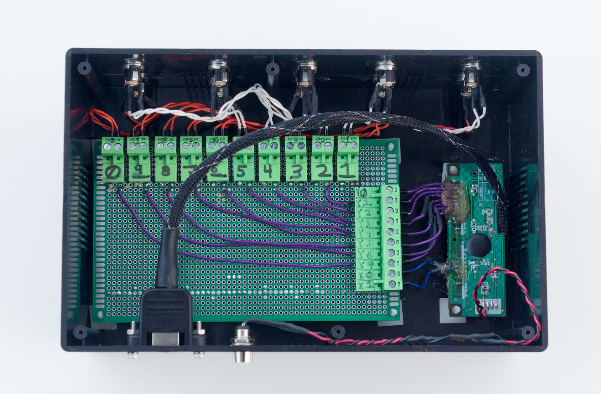

In 2022 I re-did the whole thing with a custom PCB and Arduino (which is this repository).
