# Enclosure for Jeopardy buzzer controller

<table>
<tr>
<td>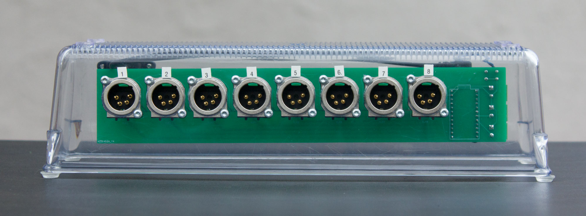</td>
<td>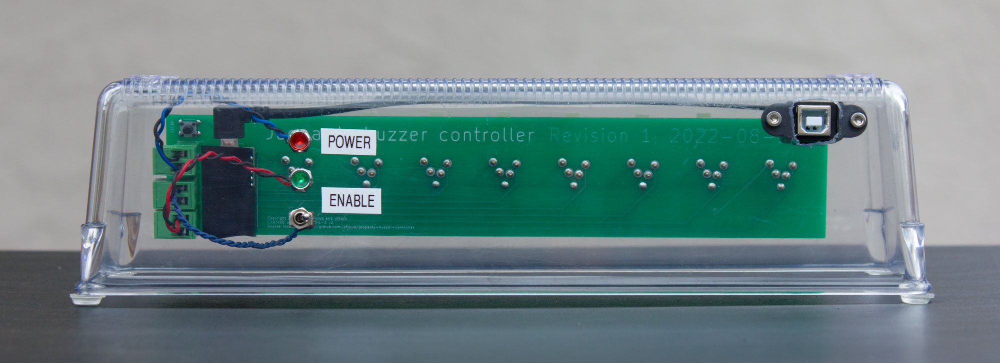</td>
</tr>
<tr>
<td>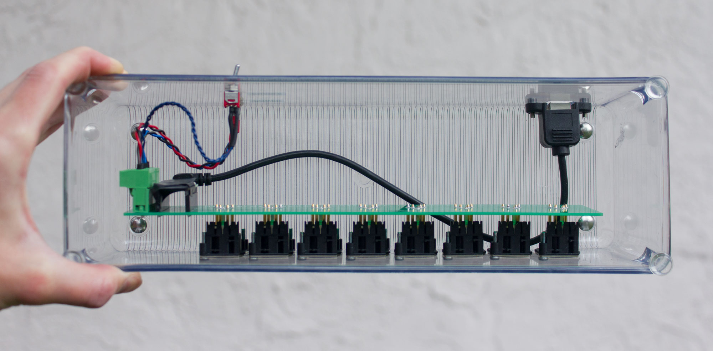</td>
<td>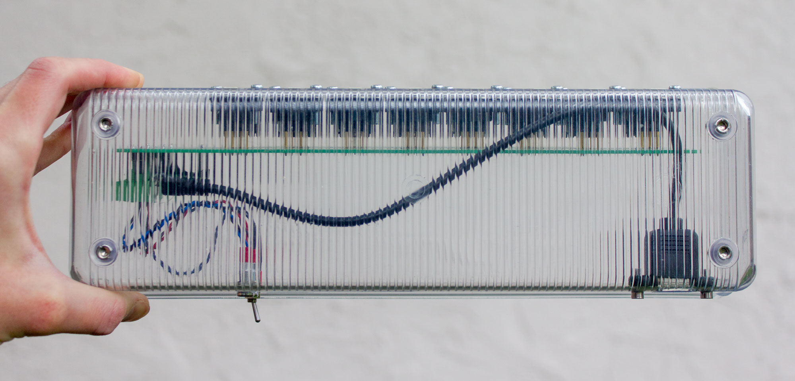</td>
</tr>
<tr>
<td align="center">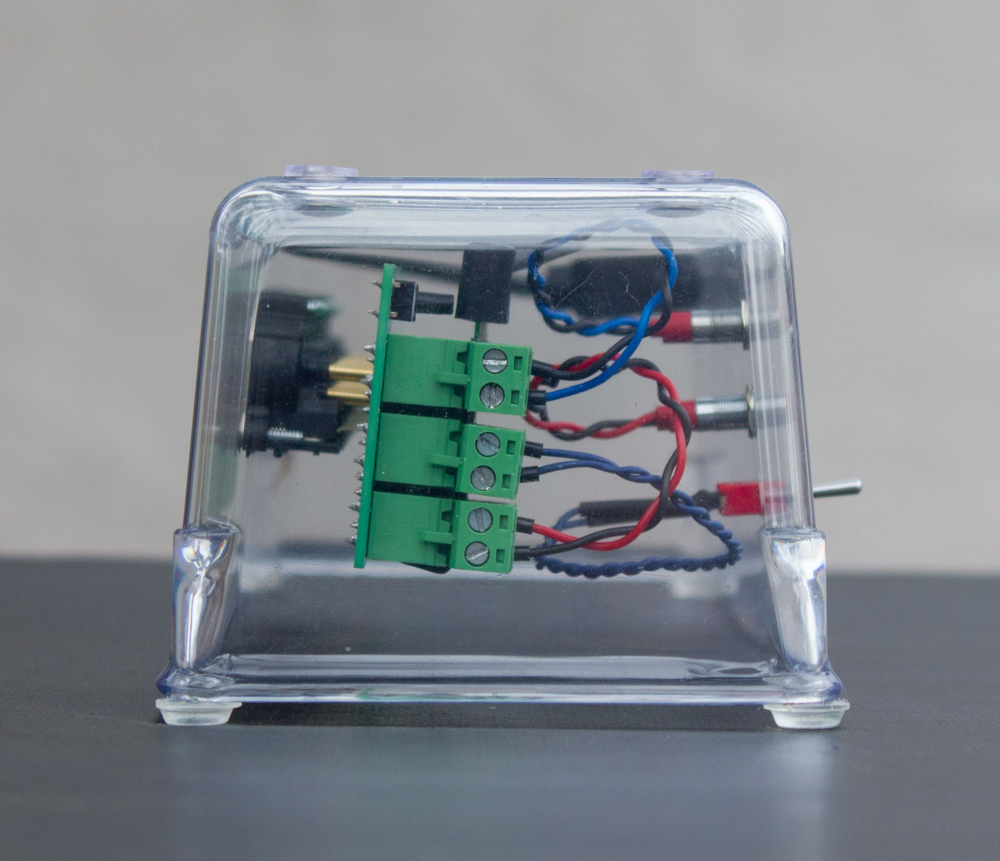</td>
<td align="center">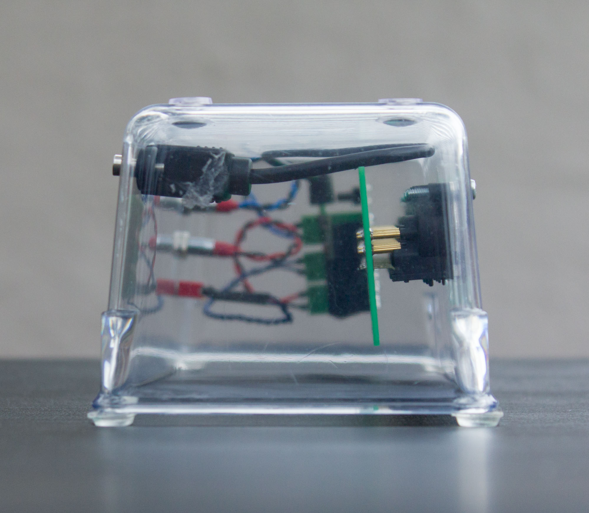</td>
</tr>
</table>

Originally I wanted a box with a lid but couldn't find one of suitable size. It turns out an open-top box turned upside-down works really well.

3D-printing may have been sensible but I didn't want layer lines, didn't want to deal with calibrating dimensions, and didn't have access to a machine with big enough print bed.

Parts:

* [Clear plastic drawer organizer](https://www.acehardware.com/departments/storage-and-organization/bath-and-kitchen/drawer-organizers/6134167).
* [Micro-USB to panel-mount USB-B cable](https://www.aliexpress.com/item/2251832817988682.html).
* Screws to mount the XLR connectors - this was a bit of a journey so I wrote a [separate document](screws-for-XLR-connectors.md) about it!

Using a transparent enclosure is weird, but being able to see through the walls was very helpful for lining up holes.

Only the XLR connectors is directly connected to the plastic wall. The PCB is light enough to hang:

<!-- https://mermaid.js.org/syntax/flowchart.html#links-between-nodes -->

## Drilling holes

To make holes for the XLR connectors, I glued a template to the enclosure then used a 7/8-inch step drill bit. The template included several concentric circles to show when a hole began going off center or out of round. Lastly I cleaned up the edges with a manual deburring tool.

<table>
<tr><td>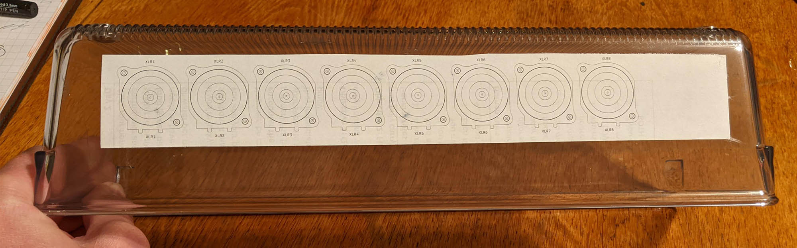</td></tr>
<tr><td>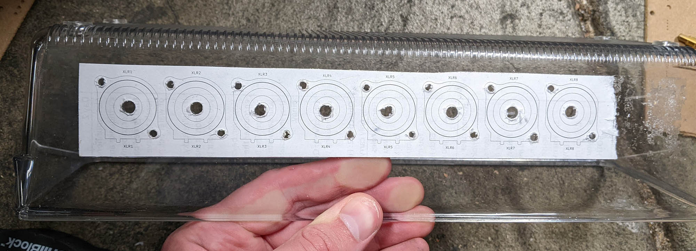</td></tr>
<tr><td>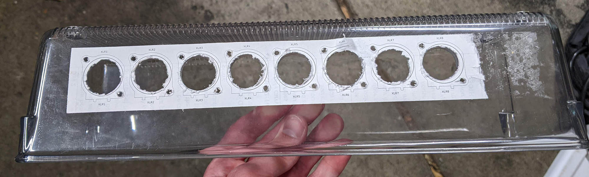</td></tr>
</tr>
</table>

## Previous tries making an enclosure

My first idea for an enclosure was a scrap of square plastic downspout:

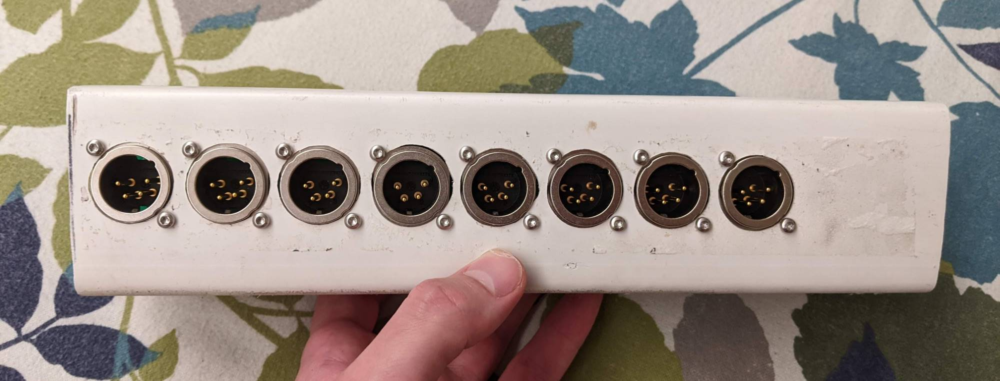

There were a few problems:

* Difficult to access the inside from the ends.
* Not enough room to attach the panel-mount USB-B connector.
* The walls flexed when drilling holes, which made the holes inaccurate and ugly.

Next I got a [wooden box](https://www.michaels.com/12in-wooden-box-by-artminds/10627739.html) which had lots of room, but was unusable because the wood splintered and broke so much.

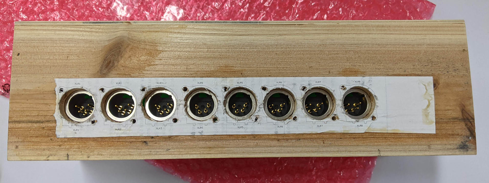
