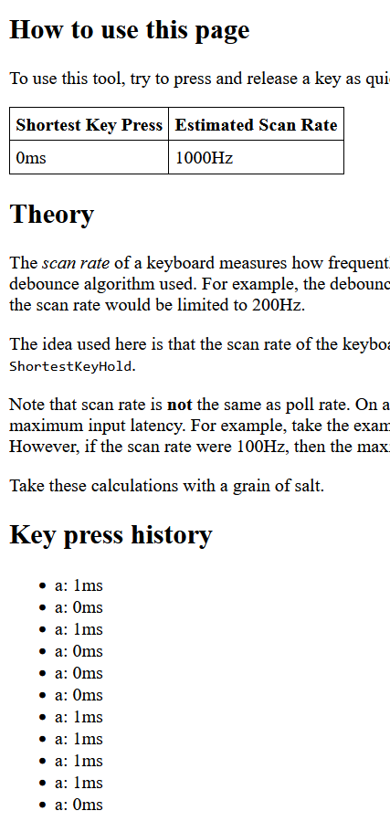
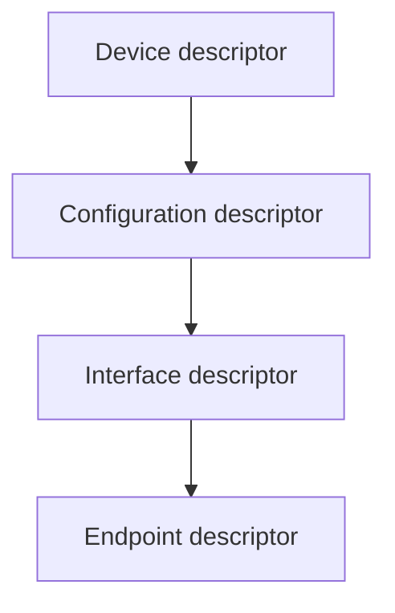
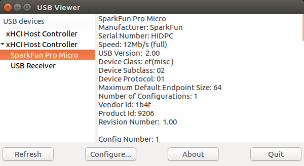

# Polling rate

This is a deep dive into the poll rate.

Polling rate is how fast the host PC queries the keyboard for inputs.

## Introduction

The keyboard tells the host PC what polling rate to use.

Excerpt from the [Endpoint Descriptors section](https://beyondlogic.org/usbnutshell/usb5.shtml#EndpointDescriptors) from USB in a Nutshell by Craig Peacock:

<blockquote>

| Offset | Field     | Size | Value  | Description |
| ------ | --------- | ---- | ------ | ----------- |
| 6      | bInterval | 1    | Number | Interval for polling endpoint data transfers. Value in frame counts. It may range from 1 to 255 for interrupt endpoints. |

* ***bInterval*** *is used to specify the polling interval of certain transfers. The units are expressed in frames, thus this equates to either 1ms for low/full speed devices and 125us for high speed devices.*

</blockquote>

Peacock writes the units are "1ms for low/full speed devices and 125us for high speed devices". What do those speed words mean?? From [Wikipedia]( https://en.wikipedia.org/wiki/USB_communications#Signaling_rate_(transmission_rate) ):

<table>
    <tr><th>Standard</th><th>Name</th><th>Signalling rate</th></tr>
    <tr><td rowspan="2">USB 1.0</td><td>Low Speed</td><td>1.5 megabit/sec</td></tr>
    <tr><td>Full Speed</td><td>12 megabit/sec</td></tr>
    <tr><td>USB 2.0</td><td>High Speed</td><td>480 megabit/sec</td></tr>
</table>

The Pro Micro uses Full speed so the intervals are in 1 millisecond frames. (The software below shows what speed the keyboard uses.)

## Definition in Arduino keyboard library

The USB HID endpoint is created in [HID.cpp](https://github.com/arduino/ArduinoCore-avr/blob/63092126a406402022f943ac048fa195ed7e944b/libraries/HID/src/HID.cpp#L32-L35):

```C++
HIDDescriptor hidInterface = {
    D_INTERFACE(pluggedInterface, 1, USB_DEVICE_CLASS_HUMAN_INTERFACE, HID_SUBCLASS_NONE, HID_PROTOCOL_NONE),
    D_HIDREPORT(descriptorSize),
    D_ENDPOINT(USB_ENDPOINT_IN(pluggedEndpoint), USB_ENDPOINT_TYPE_INTERRUPT, USB_EP_SIZE, 0x01)
};
```

The `D_ENDPOINT` macro is defined in [USBCore.h](https://github.com/arduino/ArduinoCore-avr/blob/63092126a406402022f943ac048fa195ed7e944b/cores/arduino/USBCore.h#L278-L279):

```C++
#define D_ENDPOINT(_addr,_attr,_packetSize, _interval) \
    { 7, 5, _addr,_attr,_packetSize, _interval }
```

The last parameter is the `_interval`, which is set to `0x01`. The units are one-millisecond frames so the polling rate is 1000 Hz.

## Measuring the polling rate

We can use a [scan rate estimator](https://xeonmc-archive.github.io/mkbratetools/scanrate/) tool and the Arduino sketch below to see the minimum time a key can be down for.

```C++
#include "Keyboard.h"
void setup() {
    Keyboard.begin();
}
void loop() {
    Keyboard.press('a');
    Keyboard.release('a');
    delay(2000);
}
```

Yes we are using a scan rate estimator for the polling rate. The webpage confirms:

> The *scan rate* of a keyboard measures how frequently the keyboard updates (internally) the state of its key matrix.... Note that scan rate is **not** the same as poll rate. On a USB device, *poll rate* refers to how often the OS will check the USB device for updates. The poll rate together with the scan rate determines the maximum input latency.

This device does not have a [matrix circuit](https://en.wikipedia.org/wiki/Keyboard_matrix_circuit) so the scan rate is extremely high. Assuming the scan period is zero, I think this tool lets us measure the poll rate.

Javascript keyboard events have millisecond precision. Due to rounding or aliasing or something, some of the keypresses reportedly zero milliseconds!

<!-- Use one-cell table to add border around image -->
<table align="center"><tr><td>

</td></tr></table>

## Viewing the bInterval field on the host PC

There are a lot of nested USB descriptors. The order is:

<!-- https://mermaid.js.org/syntax/flowchart.html#links-between-nodes -->


The bInterval field is in the endpoint descriptor. See <https://beyondlogic.org/usbnutshell/usb5.shtml>.

### On Linux

On the command-line, use [`lsusb`](https://linux.die.net/man/8/lsusb) with the `--verbose` option.

Excerpted output:

<details>
<summary>Expand output from <code>lsusb</code></summary>

```text
Bus 001 Device 004: ID 1b4f:9206  
Device Descriptor:
  bLength                18
  bDescriptorType         1
  bcdUSB               2.00
  bDeviceClass          239 Miscellaneous Device
  bDeviceSubClass         2 ?
  bDeviceProtocol         1 Interface Association
  bMaxPacketSize0        64
  idVendor           0x1b4f 
  idProduct          0x9206 
  bcdDevice            1.00
  iManufacturer           1 SparkFun
  iProduct                2 SparkFun Pro Micro
  iSerial                 3 HIDPC
  bNumConfigurations      1
    ...
    Interface Descriptor:
      bLength                 9
      bDescriptorType         4
      bInterfaceNumber        2
      bAlternateSetting       0
      bNumEndpoints           1
      bInterfaceClass         3 Human Interface Device
      bInterfaceSubClass      0 No Subclass
      bInterfaceProtocol      0 None
      iInterface              0 
        HID Device Descriptor:
          bLength                 9
          bDescriptorType        33
          bcdHID               1.01
          bCountryCode            0 Not supported
          bNumDescriptors         1
          bDescriptorType        34 Report
          wDescriptorLength      47
         Report Descriptors: 
           ** UNAVAILABLE **
      Endpoint Descriptor:
        bLength                 7
        bDescriptorType         5
        bEndpointAddress     0x84  EP 4 IN
        bmAttributes            3
          Transfer Type            Interrupt
          Synch Type               None
          Usage Type               Data
        wMaxPacketSize     0x0040  1x 64 bytes
        bInterval               1
```

</details>

The last line shows `bInterval` is set to one.

For a GUI, use [usbview](http://www.kroah.com/linux-usb/) by Greg Kroah-Hartman:



### On Windows

Use [USB Device Tree Viewer](https://www.uwe-sieber.de/usbtreeview_e.html) by Uwe Sieber. It is based on [USBView](https://learn.microsoft.com/en-us/windows-hardware/drivers/debugger/usbview?redirectedfrom=MSDN) in the Windows SDK.

Excerpted output:

<details>
<summary>Expand output from USB Device Tree Viewer</summary>

```text
      ========================== Summary =========================
Vendor ID                : 0x1B4F (Spark Fun Electronics)
Product ID               : 0x9206
USB Version              : 2.0 -> but Device is Full-Speed only
Port maximum Speed       : High-Speed (Companion Port 1-13 supports SuperSpeed)
Device maximum Speed     : Full-Speed
Device Connection Speed  : Full-Speed
Self powered             : no
Demanded Current         : 500 mA
Used Endpoints           : 5

      ======================== USB Device ========================

...

    ---------------------- Device Descriptor ----------------------
bLength                  : 0x12 (18 bytes)
bDescriptorType          : 0x01 (Device Descriptor)
bcdUSB                   : 0x200 (USB Version 2.0) -> but device is Full-Speed only
bDeviceClass             : 0xEF (Miscellaneous)
bDeviceSubClass          : 0x02
bDeviceProtocol          : 0x01 (IAD - Interface Association Descriptor)
bMaxPacketSize0          : 0x40 (64 bytes)
idVendor                 : 0x1B4F (Spark Fun Electronics)
idProduct                : 0x9206
bcdDevice                : 0x0100
iManufacturer            : 0x01 (String Descriptor 1)
 Language 0x0409         : "SparkFun"
iProduct                 : 0x02 (String Descriptor 2)
 Language 0x0409         : "SparkFun Pro Micro"
iSerialNumber            : 0x03 (String Descriptor 3)
 Language 0x0409         : "HIDPC"
bNumConfigurations       : 0x01 (1 Configuration)

...

        ---------------- Interface Descriptor -----------------
bLength                  : 0x09 (9 bytes)
bDescriptorType          : 0x04 (Interface Descriptor)
bInterfaceNumber         : 0x02 (Interface 2)
bAlternateSetting        : 0x00
bNumEndpoints            : 0x01 (1 Endpoint)
bInterfaceClass          : 0x03 (HID - Human Interface Device)
bInterfaceSubClass       : 0x00 (None)
bInterfaceProtocol       : 0x00 (None)
iInterface               : 0x00 (No String Descriptor)

        ------------------- HID Descriptor --------------------
bLength                  : 0x09 (9 bytes)
bDescriptorType          : 0x21 (HID Descriptor)
bcdHID                   : 0x0101 (HID Version 1.01)
bCountryCode             : 0x00 (00 = not localized)
bNumDescriptors          : 0x01
Descriptor 1:
bDescriptorType          : 0x22 (Class=Report)
wDescriptorLength        : 0x002F (47 bytes)
Error reading descriptor : ERROR_INVALID_PARAMETER

        ----------------- Endpoint Descriptor -----------------
bLength                  : 0x07 (7 bytes)
bDescriptorType          : 0x05 (Endpoint Descriptor)
bEndpointAddress         : 0x84 (Direction=IN EndpointID=4)
bmAttributes             : 0x03 (TransferType=Interrupt)
wMaxPacketSize           : 0x0040 (64 bytes)
bInterval                : 0x01 (1 ms)
```

</details>

The last line shows `bInterval` is set to one millisecond.
