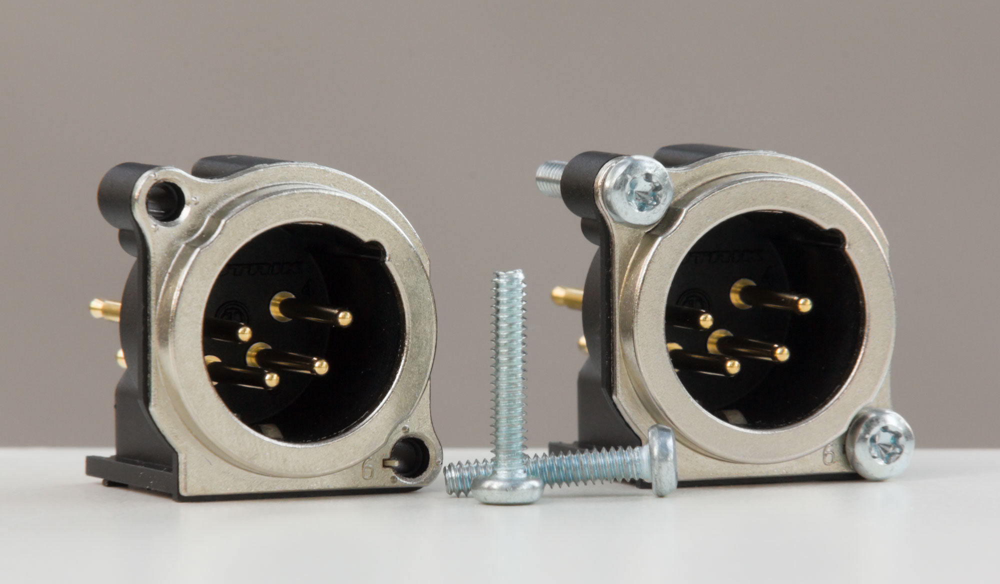

# Screws for XLR connectors

Each XLR receptacle has two holes for screws. The Neutrik website said to use [B-SCREW-1-8](https://www.neutrik.com/en/product/b-screw-1-8) which is:

> Selftapping TAPTITE® screw M2.5 DIN 7500

What does that mean??

* TAPTITE is a brand name.
* M2.5 is the thread size.
* DIN 7500 is a standard for trilobular thread-forming screws.

At the time of writing B-SCREW-1-8 were available [from Mouser](https://www.mouser.com/ProductDetail/Neutrik/B-SCREW-1-8?qs=sGAEpiMZZMsqIr59i2oRcnT%2FsgA0IPpvi2IDCmGJBT0%3D) for US$0.28 each plus $8 shipping.

I didn't think I needed to get their special brand-name screws, but it turns out that wouldn't been easier than the path I took.

First I tried regular #4-40 machine screws which I already had on hand. They made a secure hold but needed more torque than comfortably transferrable with the Phillips head. Some of the screw heads began to deform and strip.

Next I ordered [M2.5 machine screw with Torx drive](https://www.aliexpress.us/item/3256803033727043.html) (non thread-forming). Although they were the same thread size as the Neutrik screws, the diameter was slightly too small to make a secure hold. Fifty pieces cost US$1.09 shipped.

Then I found [#4-40 machine screws with Torx drive](https://www.fastenal.com/product/details/0143903) at Fastenal. The 5/8-inch length were on sale for US$0.0039 (0.39¢) each!!!

<!-- Use one-cell table to add border around image -->
<table align="center"><tr><td>

</td></tr></table>

Amusingly, the price was rounded down and displayed as "$0.00" in the table of search results:

<table align="center"><tr><td>

</td></tr></table>

I ordered 200 pieces for US$0.78 total. Shipping was US$12. These screws work well and the Torx head is pleasant to use.

5/8 inches is longer than necessary. The 1/4-inch length screws would've worked but they cost US$0.2214 each, which is more than 50 (fifty) times the price of 5/8-inch length!
